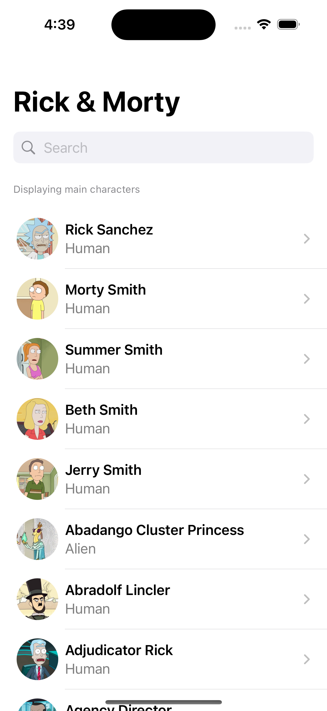
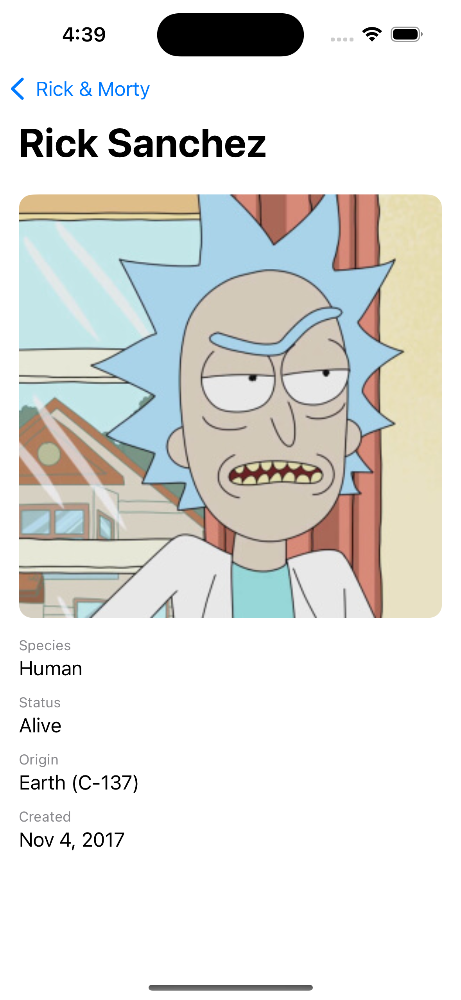
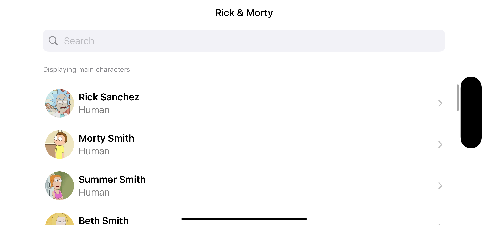
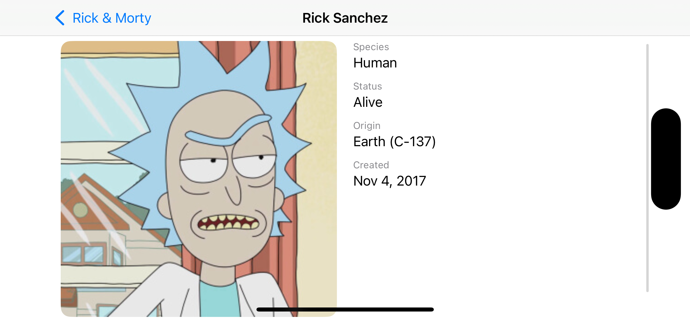
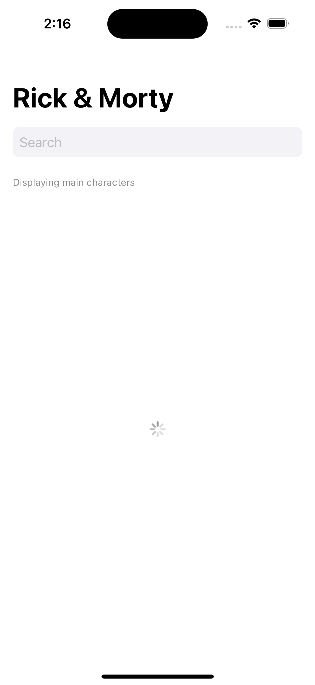

# Rick and Morty Code Challenge

## Overview

This coding challenge fetches character data from the [Rick and Morty API](https://rickandmortyapi.com/)
Allows users to search for characters, view detailed information and handle various states like loading, errors, and empty results.

## Features as pointed in instructions

- **Search Functionality**: Search for characters by name whenever you start typing and updates as the textfield changes.
- **Character List**: Displays the image and the info pointed in the insturctions PDF: Name and species
- **Character Detail View**: Detailes information about each character that includes their image (total width but added a padding for better displaying and a small corner radius), species, status, origin, and creation date.
- **Responsive Design**: This extra credit in the instructions adjusts layout for both portrait and landscape orientations.
- **Error Handling**: Displays the error messages when network issues occur according to the localized error.
- **Unit and UI Testing**: Testing added for ViewModel and UI for the search flow.

## Technologies Used

- **Swift**
- **SwiftUI**

## Installation

1. Clone the repository:
   ```bash
   git clone https://github.com/caaronperez/Rick-and-Morty-Code-Challenge.git
   ```
2. Open the project in Xcode:
   ```bash
   open Rick\ and\ Morty\ Code\ Challenge.xcodeproj
   ```
3. Run the project:
   - Select the target device or simulator
   - Press `Cmd + R` to build and run.

## Project Structure

```
Rick and Morty Code Challenge/
├── Models/
│   └── CharacterModel.swift
├── Resouces/
│   ├── NetworkManager.swift
│   └── Assets.xcassets
├── ViewModels/
│   └── CharacterViewModel.swift
├── Views/
│   ├── ContentView.swift
│   ├── CharacterRow.swift
│   └── CharacterDetailView.swift
├── Rick and Morty Code ChallengeTests/
│   ├── CharacterViewModelTests.swift
│   ├── NetworkManagerTests.swift
├── Rick and Morty Code ChallengeUITests/
│   └── AppUITests.swift
└── 
```

## How It Works

### Fetching Data

The app uses `NetworkManager` to fetch character data asynchronously, the `CharacterViewModel` handles the business logic and processing results.

### Search Functionality

The search bar in `ContentView` triggers the search functionality in `CharacterViewModel`, the`debounce` is used to reduce unecesary network calls

### Error Handling

Errors are caught and displayed in the UI.

## Running Tests

1. Open the project in Xcode.
2. Press `Cmd + U` to run all tests.

## API Reference

This project uses the [Rick and Morty API](https://rickandmortyapi.com/).

- **Endpoint**: `https://rickandmortyapi.com/api/character/`
- **Query Parameters**:
  - `name`: Filter characters by name.







Created by **Cristian Perez**.
